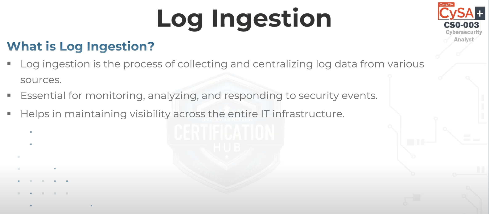

# CompTIA CySA+ CS0-003

## Domain 1.0 – Security Operations

### Topic 1.1 – Log Ingestion

---

### What is Log Ingestion?

Log ingestion is the process of collecting and centralizing log data from various systems and devices. It is foundational in security operations because it enables continuous monitoring, correlation, and analysis of data that can indicate security events or breaches. Effective log ingestion ensures that relevant data from across the IT infrastructure is captured in a centralized location such as a Security Information and Event Management (SIEM) system.

---

### Importance of Log Ingestion

#### 1. Visibility

Provides a centralized view of system and network activities. This visibility is crucial for security teams to understand what is happening across their environment.

#### 2. Detection

Enables the detection of suspicious behavior or threat indicators, such as failed login attempts, unusual traffic spikes, or unauthorized access.

#### 3. Response

Facilitates quick reaction to security incidents by correlating logs and triggering alerts. This supports incident containment and forensic investigations.

#### 4. Compliance

Maintains audit trails required for regulatory compliance and policy enforcement.

Example: Ingesting firewall logs helps detect unauthorized access attempts.

---

### Time Synchronization

Time synchronization ensures that all systems, devices, and applications across an organization use a consistent and accurate time source. This is critical for correlating events across multiple logs during incident investigation.

* Systems typically use Network Time Protocol (NTP) to stay in sync.
* Inconsistent timestamps across logs can disrupt forensic analysis and hinder root cause investigations.
* SIEM tools rely on precise timestamps to correlate events from different sources correctly.

Example: If a user logs into a VPN at 10:02 AM and accesses a server at 10:00 AM due to time mismatch, it may appear as if they accessed the system before logging in.

---

### Logging Levels

Logging levels define the severity or detail of log messages generated by systems and applications. Configuring appropriate logging levels ensures useful information is collected without overwhelming storage or analysts.

Common logging levels include:

* Debug: Highly detailed logs, usually for developers.
* Info: General operational entries about application behavior.
* Warning: Indications of possible issues that don’t stop operations.
* Error: Errors that occur during execution but don’t crash the system.
* Critical/Fatal: Serious errors that cause systems to stop or require attention.

Best practice: Use higher verbosity (e.g., Debug) during testing or investigation and moderate levels (Info, Warning) during regular operations.

---

### Log Ingestion Challenges and Solutions

#### Handling Large Volumes of Data (Scalability)

* Challenge: Massive amounts of log data from diverse sources.
* Solution: Implement scalable log architectures and storage systems that can handle growth.

#### Ensuring Data Integrity and Reliability

* Challenge: Keeping logs consistent and accurate during transmission.
* Solution: Use checksums and secure transmission methods like TLS to protect against tampering or corruption.

#### Normalization and Parsing of Log Data

* Challenge: Logs are generated in many different formats.
* Solution: Use log parsers and normalization tools to convert logs into a standard format suitable for analysis.

#### Dealing with Multiple Sources and Formats

* Challenge: Integration from various types of devices and software.
* Solution: Choose log ingestion tools that support multiple formats and devices.

---

### Log Ingestion and Network/System Architecture

#### Integration

Log ingestion systems must integrate smoothly with the existing IT infrastructure, including servers, routers, switches, applications, and cloud services.

#### Data Flow

Ensures seamless transmission of logs from endpoints to the central logging system.

#### Security

Applies encryption to protect log data in transit and storage.

#### Management

Tools like SIEMs support the aggregation, indexing, and querying of large volumes of logs for operational and security use.

Example: A SIEM solution (e.g., Splunk) ingests logs from multiple sources and helps in visualizing and responding to threats.

---

### Types of Logs

* System Logs: Generated by the operating system. Examples include boot logs, system error logs, and kernel logs.
* Application Logs: Created by software applications. These include user activity logs, transaction logs, and application error logs.
* Network Logs: Logs from routers, switches, and firewalls that monitor traffic and detect network anomalies.
* Security Logs: Focus on security-related events such as authentication failures, intrusion detection, and access violations.

---

### Log Sources

* Servers: Generate logs for applications, OS-level events, and services. Example: Web server access logs.
* Workstations: Record user activity such as logins. Example: Windows Event Logs.
* Network Devices: Include routers, switches, and firewalls. Example: Blocked port access from a firewall log.
* Security Devices: Systems like IDS/IPS that generate logs for threat detection.
* Cloud Services: Example: AWS CloudWatch logs that record cloud resource behavior and usage.

---

### Examples of Log Sources

* Wireshark (PCAP): Captures and analyzes network packets to identify anomalies.
* TCPDump: Command-line packet capture tool.
* SNORT: IDS tool that analyzes traffic for known threat patterns.
* NextGen Firewall IDS/IPS: Logs blocked/malicious traffic.
* NetFlow: Captures metadata about traffic flows.
* Honeypots: Collects interaction logs from attackers for analysis.

---

### Log Collection Methods

* Agent-Based Collection: Requires an agent (like Splunk Forwarder) installed on each source device.
* Agentless Collection: Uses standard protocols (e.g., SSH, WMI) to collect logs remotely without agents.
* Syslog and Variants (Syslog-NG, Rsyslog): Widely used in UNIX/Linux for message logging.
* Windows Event Forwarding (WEF): Microsoft-native system to aggregate logs from multiple endpoints.
* SNMP Traps: Sends alerts from network devices to a centralized logging platform.

---

### Using Ingested Logs for Security Operations

#### Real-Time Monitoring and Alerting

Continuously observes logs and generates alerts for anomalies.

Example: Detecting brute-force login attempts.

#### Historical Analysis and Forensics

Investigate past incidents using retained logs to identify root causes and attack timelines.

#### Log Correlation

Combine logs from different systems to gain a holistic understanding of complex attacks.

Example: Correlating logs from firewall, IDS, and servers to detect coordinated attacks.

---
### Syslog in Log Ingestion

#### Client-Server Protocol

Syslog operates using a client-server model where clients generate and send log messages to a centralized syslog server. This architecture supports centralized logging for easier monitoring and management.

#### Clear Text

Syslog messages are typically sent in plain text, making them easy to read and interpret. However, this also means they must be protected with secure transmission protocols (e.g., TLS) to prevent tampering or interception.

#### Examples of Common Event IDs

* Type 2 / 3 Events: Specific types of events logged by systems.
* Event ID 529: Logon failure due to unknown username or bad password.
* Event ID 530: Logon failure due to logon time restriction.

#### Syslog Daemon and Syslog Server

* Syslog Daemon: Software that receives and processes log messages.
* Syslog Server: A centralized system that stores and manages log data.

Example: A server running Rsyslog to collect and organize logs from multiple devices.

---

### Reference

Source video: [CompTIA CySA+ (CS0-003) | Domain 1.1 – Log Ingestion](https://youtu.be/nFIX51C6E1M?si=9MQFluv11yVLljpk)

All slides and visuals used are from the Certification Hub YouTube training video for CySA+ and are intended for educational purposes only.
