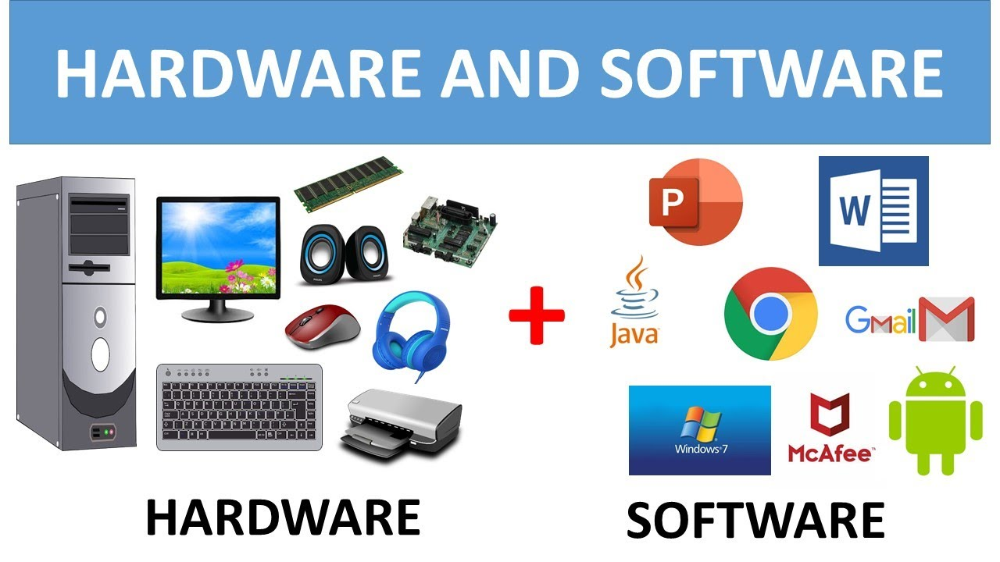

# IT Fundamentals

Welcome to the IT Fundamentals section. This serves as your first step toward becoming a Cybersecurity Analyst by learning the essential concepts of computers, systems, and digital environments.

---

## What Are IT Fundamentals?

IT (Information Technology) Fundamentals cover the basic building blocks of computer systems and software that are necessary to understand before diving into security topics.

### Topics Covered

* What is a Computer?
* Hardware vs. Software
* Input/Output Devices
* Operating Systems
* File Systems and Storage
* Types of Software
* How the Internet Works (Basics)

---

## Key Concepts & Examples

### What is a Computer?

A computer is an electronic device that processes data based on input, stores it, and produces output. It has both hardware and software components.

Example: A laptop that runs Windows or macOS is a computer. It takes input from your keyboard, processes it, and shows output on your screen.

### Hardware vs. Software

* Hardware: Physical components like CPU, RAM, hard disk, keyboard
* Software: Programs that run on hardware like web browsers, operating systems, games

### Input/Output Devices

* Input Devices: Keyboard, Mouse, Microphone
* Output Devices: Monitor, Printer, Speakers

### Operating System (OS)

An Operating System manages hardware and software resources and provides services for programs.

Popular OS: Windows, macOS, Linux, Android, iOS

### File System & Storage

* File systems organize how data is stored and retrieved.
* Common formats: FAT32, NTFS, ext4

Example: When you save a Word file, it's stored on your hard drive using a file system.

### Types of Software

* System Software: Operating systems, drivers, utilities
* Application Software: Word processors, browsers, games

---

## Recommended Tools to Explore

| Tool              | Purpose                      |
| ----------------- | ---------------------------- |
| Windows OS Tools  | File Explorer, Task Manager  |
| Linux VM (Ubuntu) | Learn command-line basics    |
| CPU-Z             | View hardware specifications |

---

## Recommended Certifications

### <a href="https://www.comptia.org/certifications/it-fundamentals"><u>CompTIA IT Fundamentals (ITF+)</u></a>

* Entry-level certification for absolute beginners  
* Covers basic IT literacy, hardware, software, OS, and networking

### <a href="https://www.comptia.org/certifications/a"><u>CompTIA A+</u></a>

* Ideal for those moving from IT support to cybersecurity  
* Covers troubleshooting, networking, OS, security, and operational procedures

---

## Hands-On Activities

* Explore Device Info:

  * On Windows: Open Task Manager → Performance tab
  * On Mac: Apple Menu → About This Mac

* Create Files & Folders:

  * Practice using File Explorer and Terminal commands like `mkdir`, `cd`, and `touch`

---

## Free Learning Resources

* [Full IT Fundamentals Course (YouTube)](https://youtu.be/WWbP246ZWck?si=ljJrmV33yQe55sjg)
* [Google IT Support Professional Certificate (Coursera)](https://www.coursera.org/professional-certificates/google-it-support)

---

Now that you understand IT Fundamentals, continue with [Networking](networking.md) to learn how computers connect and communicate securely.
