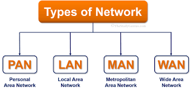
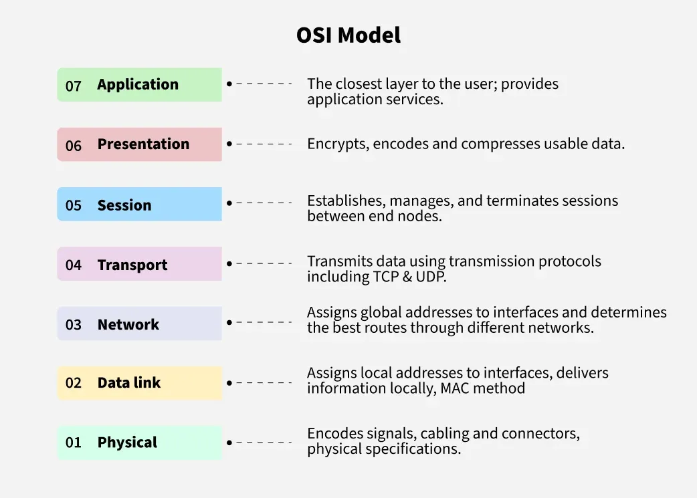
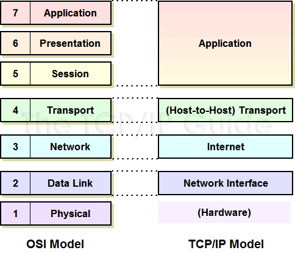

# Networking

This section introduces you to computer networking from scratch. As a cybersecurity analyst, you must understand how data flows across devices and the potential vulnerabilities that arise at each step.

---

## What is Networking?

Networking is the practice of connecting computers and other devices to share resources and communicate. It includes both hardware (routers, switches, cables) and protocols (rules) that manage the flow of information.

---

## Key Topics Covered

* What is a Network?
* Types of Networks (LAN, WAN, PAN, etc.)
* IP Addressing and Subnetting
* OSI Model vs TCP/IP Model
* DNS, DHCP, MAC Address
* TCP vs UDP Protocols
* VPN and Firewalls
* Common Protocols (HTTP, FTP, SSH, etc.)
* Network Devices (Switch, Router, Hub, etc.)
* Public vs Private IPs

---

##  Explanations

### What is a Network?

A network is a group of two or more computers connected to share data or resources.

Example: At home, your phone, laptop, and smart TV are likely connected to the same Wi-Fi network.

### LAN, WAN, MAN and PAN

* **LAN** (Local Area Network): Covers a small area like a home or office
* **WAN** (Wide Area Network): Spans a large geographic area (e.g., the internet)
* **PAN** (Personal Area Network): Very small network like Bluetooth connections
* **MAN**  (Metropolitan Area Network): Covers a city or campus and is larger than LAN but    smaller than WAN.

### IP Addressing

An IP address is a unique identifier assigned to every device on a network.

Example: `192.168.1.1` is a common default IP address for routers.

### OSI Model (7 Layers)

The OSI (Open Systems Interconnection) model is a conceptual framework used to understand and implement networking protocols in seven layers:

1. **Physical** – Transmits raw bit streams over a physical medium (cables, fiber optics).
2. **Data Link** – Establishes a reliable link between two directly connected nodes and handles error correction from the physical layer.
3. **Network** – Responsible for packet forwarding and routing through routers using IP addresses (e.g., IPv4/IPv6).
4. **Transport** – Ensures reliable data transfer with protocols like TCP and UDP.
5. **Session** – Manages sessions or connections between computers (e.g., logging in remotely).
6. **Presentation** – Translates data between the application and network formats (e.g., encryption, compression).
7. **Application** – Provides end-user services such as email, file transfers, and browser access (HTTP, FTP, etc.).

Understanding OSI layers helps in troubleshooting and identifying which stage a networking issue may occur.

### TCP/IP Model

The TCP/IP model is a simplified 4-layer framework used in practical networking today:

1. **Link Layer** – Combines OSI's Physical and Data Link layers, handling device-to-device data delivery.
2. **Internet Layer** – Matches OSI's Network layer, handling IP addressing and routing.
3. **Transport Layer** – Provides reliable or unreliable data transfer with TCP and UDP.
4. **Application Layer** – Combines OSI's Session, Presentation, and Application layers.

The TCP/IP model underpins the internet and is the basis for most networking protocols in real use.

### TCP vs UDP

* **TCP (Transmission Control Protocol)**: Reliable, connection-based protocol. Used for web browsing, email, and file transfers.
* **UDP (User Datagram Protocol)**: Faster but less reliable. Used for streaming, gaming, and VoIP.

### DNS, DHCP, MAC Address

* **DNS**: Translates domain names (like google.com) into IP addresses
* **DHCP**: Assigns IP addresses automatically
* **MAC Address**: A unique hardware identifier for network interfaces

### VPN (Virtual Private Network)

A VPN creates a secure, encrypted tunnel between your device and the internet. It hides your IP address and protects data over public networks.

Example: Using a VPN on public Wi-Fi to safely browse without exposing sensitive information.

### Firewall

A firewall is a security system that monitors and controls incoming and outgoing network traffic. It can be hardware or software-based.

Example: Windows Firewall blocks unauthorized access to your system from the internet.

---

## Tools to Try

| Tool                | Use Case                          |
| ------------------- | --------------------------------- |
| Packet Tracer       | Network simulation and practice   |
| Wireshark           | Analyze network traffic (packets) |
| Nmap                | Scan ports on a network           |
| ipconfig / ifconfig | View network configuration        |

---

## Hands-On Activities

* Use `ipconfig` (Windows) or `ifconfig` (Linux/macOS) to find your IP address
* Install Wireshark and monitor traffic while browsing
* Try Packet Tracer to build a sample LAN with 2 PCs and a switch
* Use `tracert` or `ping` to test connectivity

---

## Recommended Certifications

### <a href="https://www.comptia.org/certifications/a"><u>CompTIA A+</u></a>

* Introduces networking basics, IP addressing, and device configuration

### <a href="https://www.comptia.org/certifications/network"><u>CompTIA Network+</u></a>

* Dedicated to networking concepts, protocols, security, and troubleshooting

---

## Free Learning Resources

* [Cisco Networking Basics - YouTube](https://youtu.be/vOEJqFWLT70?si=WQMyiW3oRhrXH08S)
* [CompTIA Network+ Study Guide (Professor Messer)](https://youtube.com/playlist?list=PLG49S3nxzAnl_tQe3kvnmeMid0mjF8Le8&si=2VOvx4sUqCrLTrwv)
* [Practical Networking](https://www.practicalnetworking.net/)

---

Next, learn about [Operating Systems](operating-systems.md) and how they interact with networks and hardware.
