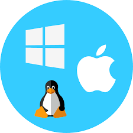

# Operating Systems

Operating systems (OS) are the backbone of all computing devices. They manage hardware, run applications, and provide an interface for users to interact with their systems. As a cybersecurity analyst, understanding how different OSs work is crucial for securing systems, investigating incidents, and writing platform-specific scripts.

---

## What is an Operating System?

An operating system is system software that acts as an intermediary between the user and computer hardware. It manages resources like CPU, memory, storage, and I/O devices.

### Common Operating Systems:


* **Windows** – Dominant in enterprise and consumer environments
* **Linux** – Widely used in servers, cybersecurity labs, and programming
* **macOS** – Unix-based, common in design and development environments

---

## Key Responsibilities of an OS

* **Process Management** – Handles execution of processes (running applications)
* **Memory Management** – Allocates RAM to processes and prevents overlap
* **File System Management** – Organizes and stores files
* **Device Management** – Manages hardware like disks, USBs, printers
* **User Interface** – CLI (Command Line Interface) and GUI (Graphical Interface)

---

## Linux vs Windows vs macOS

| Feature        | Windows                | Linux                      | macOS                |
| -------------- | ---------------------- | -------------------------- | -------------------- |
| Base           | NT Kernel              | Unix/Linux Kernel          | Unix (Darwin)        |
| CLI            | PowerShell / CMD       | Bash / Zsh                 | Zsh / Bash           |
| File System    | NTFS                   | ext4, xfs, btrfs           | APFS, HFS+           |
| Security Tools | Defender, Sysinternals | iptables, auditd, AppArmor | Gatekeeper, XProtect |

---

## File System Basics

* Windows: NTFS organizes files in folders with access control lists (ACLs)
* Linux: Follows a hierarchical structure starting from `/` (root)
* macOS: Similar to Linux with its Unix base

### Example:

Linux path: `/home/user/documents`
Windows path: `C:\Users\User\Documents`

---

## User Management & Permissions

* **Linux**: Users, groups, root account, permission flags (rwx)
* **Windows**: Users, Administrators group, NTFS permissions

### Example Linux Permissions:

```bash
chmod 755 script.sh
ls -l script.sh
```

---

## Hands-On Commands

### Windows (PowerShell):

```powershell
Get-Process
Get-EventLog -LogName Security
```

### Linux (Bash):

```bash
ps aux
df -h
cat /etc/passwd
```

---

## Important OS Concepts in Cybersecurity

* **Root/Admin Access** – Elevated privileges that can install software or change system settings
* **System Logs** – Audit logs, event viewer, auth logs, syslog
* **Services/Daemons** – Background processes (e.g., sshd, httpd, winlogbeat)
* **Patch Management** – Keeping OS and applications up to date

---

## Recommended Tools

* **Windows:** Sysinternals Suite, Event Viewer, Process Explorer
* **Linux:** journalctl, top, netstat, ufw
* **Cross-platform:** VirtualBox, VMware, Wireshark

---

## Recommended Certifications

### <a href="https://www.comptia.org/certifications/linux"><u>CompTIA Linux+</u></a>

* Focuses on Linux system administration and scripting

---

## Free Learning Resources

* [Operating Systems - CrashCourse](https://youtube.com/playlist?list=PL6UYGa2xbJjVQ4ox3PhJJ-6DyfgvRsnST&si=APXm-S8DUWI7Z-7f)


---

Once you're comfortable with operating systems, move on to [Basic Scripting](basic-scripting.md) to begin exploring core cybersecurity concepts.
