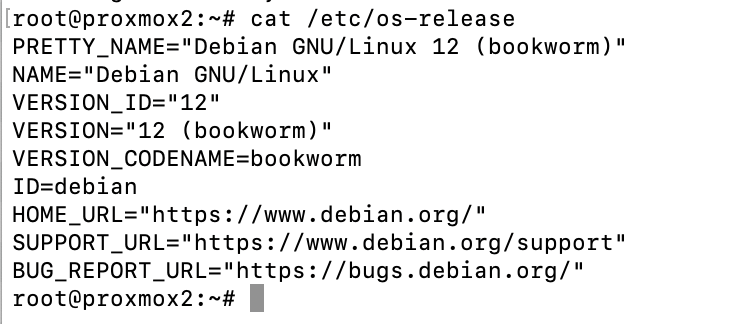
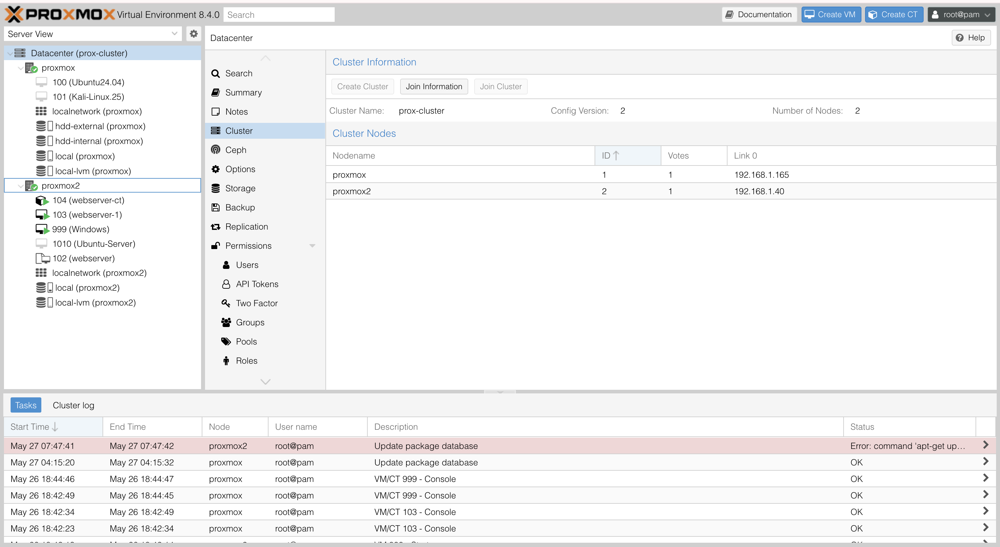
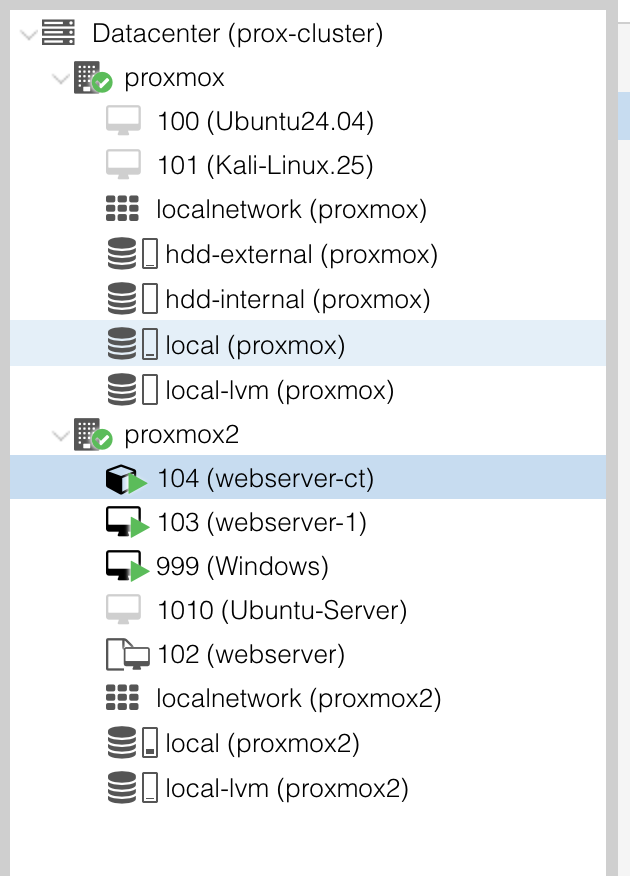

# 💻 $0 Home Server Setup for Cybersecurity Labs

This guide documents how I turned an unused laptop into a powerful Proxmox-based home server to run cybersecurity labs, virtual machines, and personal services — all at zero cost.

---

## 📦 Hardware Used

- Old laptop (Intel i5, 8GB RAM, 500GB HDD)
- Ethernet cable (wired to router for stability)
- Optional external drive for VM storage

---

## Hardware Setup Overview

Here’s a look at the physical setup of the $0 home server lab, built using minimal resources and maximum optimization.

### 📷 Lab Overview


- The laptop on the **right** is used as the **main Proxmox host**, running Debian with Proxmox VE installed.
- It is connected to the router using a **direct Ethernet cable**, which ensures a stable, low-latency connection necessary for VM hosting and remote access.
- The laptop in the **center** runs as a **second Proxmox node**, which was **clustered with the first laptop** using Proxmox's web interface under `Datacenter > Cluster`.
- This setup allows for **resource distribution, high availability testing**, and a real-world simulation of a production cluster.

- The **MacBook on the left** serves as the **admin/control machine**, used to:
  - SSH into the servers
  - Manage the Proxmox dashboard
  - Handle downloads, ISO uploads, and DuckDNS configuration

### ❄️ Cooling + Hardware


- One laptop (when idle or in backup role) is stored on a **USB-powered cooling pad** to minimize heat buildup.
- This setup ensures better airflow and **longer uptime** without thermal throttling.

---

By repurposing available devices and using simple networking (Ethernet and a home router), I created a scalable Proxmox cluster that supports multiple VMs for cybersecurity practice, system testing, and remote lab use.


---

## 🔧 Step-by-Step Setup

---

### 1️⃣ Install Debian (Minimal ISO)

Installed Debian 12 (Bookworm) using a bootable USB.

**Commands Used:**
```bash
cat /etc/os-release
```

📸 _Screenshot placeholder: Debian terminal or OS confirmation screen_  
→ 

---

### 2️⃣ Install Proxmox VE on Debian

Added the Proxmox repository manually and installed the full virtual environment stack.

**Key Commands:**
```bash
echo "deb http://download.proxmox.com/debian/pve bookworm pve-no-subscription" | sudo tee /etc/apt/sources.list.d/pve-install-repo.list
wget http://download.proxmox.com/debian/proxmox-release-bookworm.gpg -O /etc/apt/trusted.gpg.d/proxmox-release.gpg
sudo apt update
sudo apt install proxmox-ve postfix open-iscsi -y
```

📸 _Screenshot placeholder: Proxmox dashboard showing `proxmox2` node_  
→ 

---

### 3️⃣ Proxmox Web Access via Local IP

Accessed Proxmox from browser on local network:

```
https://192.168.1.40:8006
```

Accepted the self-signed certificate warning.

---

### 4️⃣ Create and Launch VMs

Used Proxmox’s "Create VM" wizard to set up:

- ✅ Kali Linux (for offensive tools)
- ✅ Ubuntu Desktop/Server (for testing + hosting)
- ✅ Metasploitable 2 (vulnerable target)
- ✅ Windows 10 (for malware or blue team analysis)

Snapshots and isolated networks created for lab use.

📸 _Screenshot placeholder: VM list view in sidebar_  
→ 

---

### 5️⃣ [Planned] Setup DuckDNS Domain

Plan: Register a free dynamic DNS domain like:

```
funkyy.duckdns.org
```

Link it to public IP for remote access.

---

### 6️⃣ [Planned] Port Forwarding and SSL

Plan: Configure router to forward:

| External Port | Internal IP     | Port | Use Case        |
|---------------|------------------|------|------------------|
| 80            | 192.168.1.40     | 80   | HTTP + ACME      |
| 443           | 192.168.1.40     | 443  | HTTPS (Proxmox)  |

Then use **Let's Encrypt (ACME)** to secure the web interface.

📸 _Screenshot placeholder: Router config and Proxmox ACME tab_

---

## 💡 Why This Setup Matters

- Real-world practice with hypervisors, networks, and system setup
- Foundation for offensive/defensive labs
- Self-hosting Nextcloud, Juice Shop, DVWA, or ELK Stack
- Cost-effective, educational, and customizable

---


> Work in Progress — DuckDNS and Let's Encrypt configuration to be added soon.